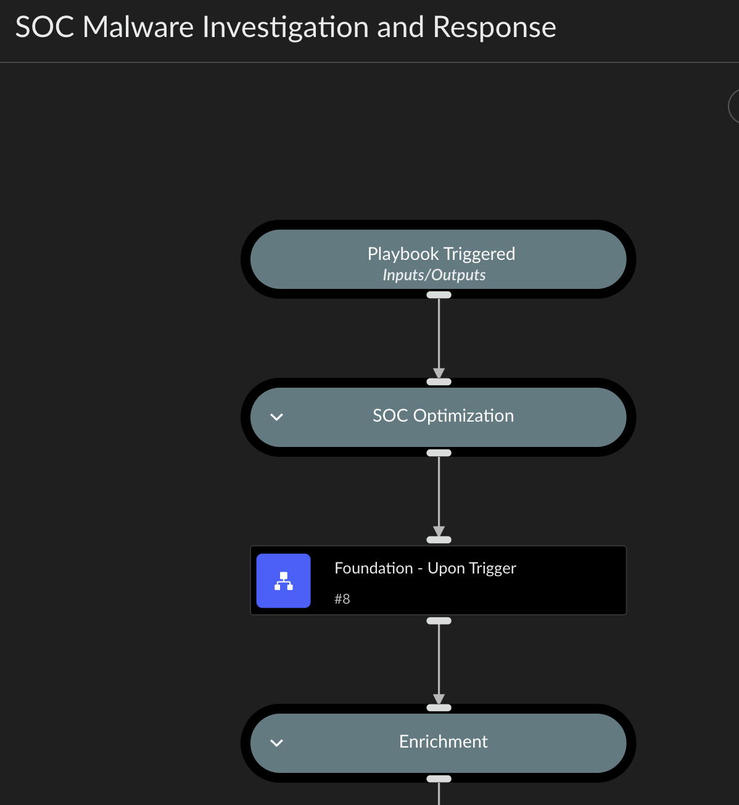
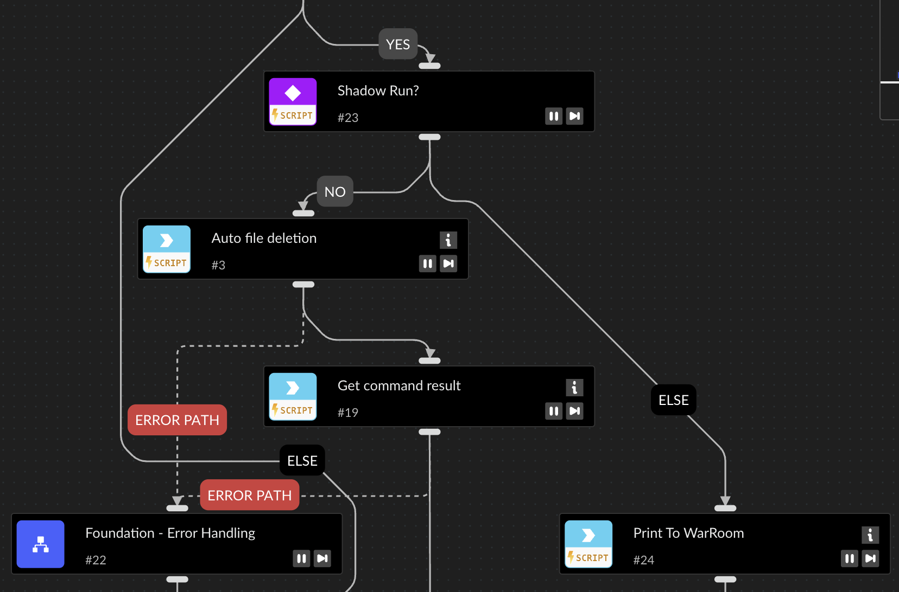
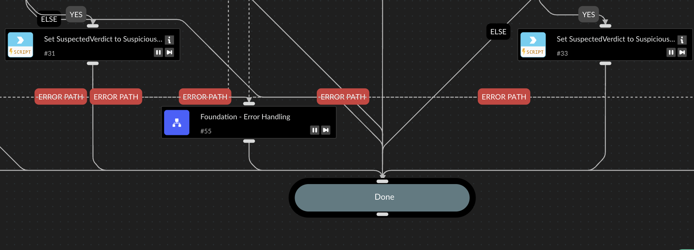

# SOC Identity Analytics Playbooks (XSIAM)

This repository contains Cortex XSIAM playbooks designed for identity-based threat detection and response within a Security Operations Center (SOC) environment. These playbooks focus on suspicious user behavior, privilege escalation, and lateral movement—empowering analysts to investigate identity-driven threats with context-rich, repeatable automation.

## Overview

The playbooks in this repo:
- Leverage the [soc-optimization](https://github.com/Palo-Cortex/soc-optimization) framework.
- Begin with a standardized **"Upon Trigger"** playbook for consistent initial conditions.
- Include safety features such as **Shadow Mode** and **Error Handling**.

## Key Concepts

### 1. Upon Trigger Playbook

The first task of every parent playbook is to invoke the `Foundation - Upon Trigger` sub-playbook. This is a standardized routine imported from the `soc-optimization` framework.

#### Purpose
- Ensure a consistent playbook environment.
- Set identity-specific context fields (e.g., user risk, asset roles).
- **Activate Shadow Mode**, which is crucial for safe testing and development.
- Establish context variables required for downstream enrichment and decisioning.

#### Shadow Mode
When Shadow Mode is enabled:
- All tasks that could modify identity infrastructure (e.g., disable user, reset password, revoke sessions) are **skipped or simulated**.
- These tasks instead **print the intended action to the War Room**, allowing teams to validate logic before enabling in production.

#### Screenshot - Upon Trigger:

#### Screenshot - Shadow Mode Example:

---

### 2. Error Handling

All playbooks call a standard `Error Handler` sub-playbook to:
- Log task failures
- Print tracebacks to the War Room
- Flag incidents for manual review when critical automation fails

#### Screenshot - Error Handling:

---

## Requirements

- Cortex XSIAM v2.5+
- Identity telemetry sources (e.g., Okta, Azure AD, O365 logs)
- Dependencies outlined in the [soc-optimization](https://github.com/Palo-Cortex/soc-optimization) repo

---

## Dependency Graph

